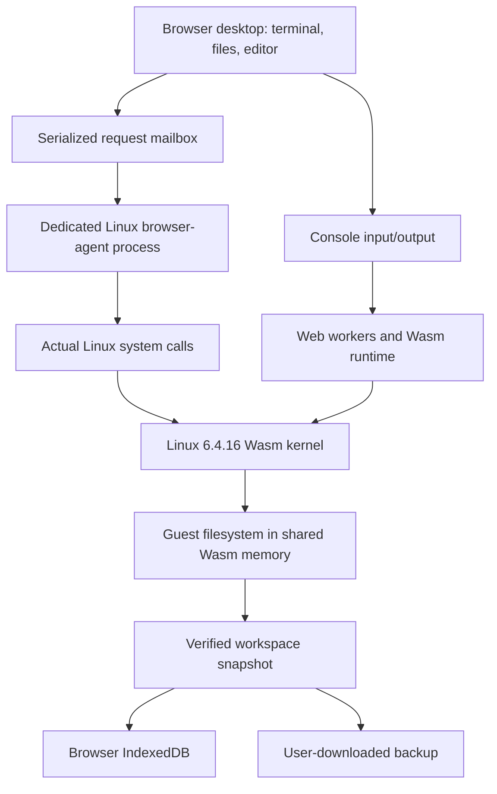

# Architecture and isolation

The browser instantiates the kernel directly as WebAssembly. There is no instruction-set emulator and no remote Linux machine. This follows the existing experimental Wasm architecture port; it is not a claim that unmodified upstream Linux supports browsers.

`public/runtime/linux.js` manages worker creation, guest scheduling messages, console input and a serialized RPC queue. `linux-worker.js` instantiates kernel and userspace Wasm modules. Kernel scheduling is cooperative with the host runtime and uses shared memory. The port has no MMU isolation between guest processes and kernel memory. Guest `root` is privileged within this guest, not within Windows. The outer browser sandbox remains the host boundary.

The new `guest/browser-agent.wat` is loaded by Linux's Wasm executable loader as a separate guest process. Its imported bridge routine operates within that task, calling the kernel's syscall exports with the task's user stack. It uses Linux `openat`, `read`, `write`, `getdents64`, `mkdirat`, `unlinkat`, `symlinkat`, `renameat2` and `ioctl`. The file manager and shell therefore see the same inodes. There is no JavaScript imitation of the Linux filesystem.

The agent reserves its own 1 MiB data region through `dylink.0`. Desktop requests travel in a separate SharedArrayBuffer; results are structured-cloned back. Calls are serialized, time out after 30 seconds and stop the session if the bridge becomes unresponsive. File uploads are chunked and renamed from a unique temporary file in the same directory. GUI writes reject parent symlinks and stay inside `/home/web`. These GUI checks are convenience boundaries; arbitrary guest code can change the entire guest filesystem.

## Persistence

On boot, the app validates the stored backup's structure and checksum, starts a fresh kernel, waits for both the guest bridge and interactive shell, then restores the workspace. It compares a fresh whole-workspace fingerprint with the expected backup before enabling autosave. A failed restore stops the workers and leaves IndexedDB untouched. The error banner can export the last saved backup without needing a running kernel.

A save reads two snapshots, hashes their contents and checks they agree. It also verifies that the session did not change while saving. A single IndexedDB transaction updates the saved workspace and retains the previous changed version. A Web Lock permits only one active machine per browser origin. Editor drafts are stored separately, and the editor asks before overwriting a file modified from the shell.

This is best-effort recovery for an experimental kernel. Two matching reads cannot detect corruption that already occurred consistently before both reads, and the kernel has no transactional filesystem snapshot. Closing a tab can interrupt an outstanding save. The current and previous saves both live in the same browser storage; exported backups are independent copies.

## Host effects

The development server reads only `public/` and answers GET/HEAD requests. It has no upload route, command execution route, native filesystem bridge or guest access to the host disk. The browser can import a copy of a file explicitly selected by the user and export downloads through normal browser mechanisms.

Files were created inside the project workspace. The existing Node/Python runtimes and installed browsers were used for building and testing. No operating system, bootloader, partition, registry setting, driver, WSL distribution, Docker installation, firewall rule or background service was installed or modified. There are no telemetry calls or third-party runtime CDN dependencies.

The server is loopback-only. Closing the browser tab terminates the guest workers. Stopping the local server does not remove saved browser data. To discard that data, use the browser's site-data controls for the local origin after exporting anything wanted. Other projects using exactly the same origin and storage names would share that namespace.

## Performance boundary

Removing DWARF debug metadata reduced the shipped kernel from 29,966,656 to 3,710,340 bytes without changing executable sections. Compiling directly to Wasm avoids emulating a foreign CPU, but JavaScript crossings, worker creation, kernel scheduling and browser policies still add overhead. The memory selector controls guest linear memory, not total browser RAM. The current port's CPU configuration is inherited and is not a validated “use every core optimally” scheduler.

No native-performance comparison has been established. Browser execution cannot promise unrestricted host drivers, raw sockets, direct GPU ownership, unlimited RAM or immunity from tab suspension. Future acceleration must use browser APIs and preserve their security model.
