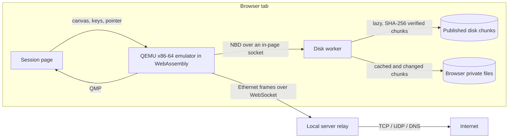

# x86-64 Linux desktop engine

The goal: a genuine, local Linux distribution in a browser tab that runs ordinary Linux programs, with a Wayland desktop, a path to GPU acceleration, and the official Minecraft: Java Edition launcher installed and run inside it. No native service, driver, hypervisor or host OS change is needed on the user's device. Builds happen in isolated GitHub Actions jobs; the guest always executes in the user's browser.

The original Linux/Wasm engine (Linux 6.4 compiled to WebAssembly) remains available and unchanged. It cannot run ordinary x86-64 or ARM programs.

## Architecture



- **Processor.** [QEMU-Wasm](https://github.com/ktock/qemu-wasm) translates x86-64 guest code into WebAssembly (TCG), runs a normal PC (`pc` machine, SeaBIOS) and supports several virtual CPUs as Web Workers (MTTCG). The default guest CPU model is `Westmere` (x86-64-v2: SSE4.2, POPCNT, AES-NI, PCLMUL), which every current x86-64 Linux distribution and Java runtime accepts; `?cpu=max` offers AVX and AVX2 as well, at the cost of slower and less-tested translation paths. x86-64 was chosen because the official Minecraft launcher is published for x86-64 Linux only; an AArch64 build of the same emulator is possible but would not run that launcher.
- **Guest.** Debian 13 with a kernel.org 6.18 LTS kernel that has every virtual device built in (no initramfs or module loading at boot), sysvinit with a short boot script, Weston 14 (Wayland) with Xwayland for X11 programs, foot, Mesa (OpenGL 4.5 core through llvmpipe today), apt, Python, and the GTK and Chromium-embedded libraries the Minecraft launcher needs. The desktop user `user` has password-less sudo in their own browser-local machine.
- **Disk.** The 16 GiB ext4 disk is published as 1 MiB content-addressed gzip chunks; all-zero chunks are omitted, so the used 1.08 GB of filesystem costs at most 350 MiB to download, and only the parts Linux reads are fetched. A disk worker serves the image to QEMU's built-in NBD client, verifies each chunk's SHA-256, and keeps downloaded and modified chunks in the browser's origin-private file system (OPFS). Changes persist as Linux writes them; there is no separate "save" step. Guest flushes make writes durable, the chunk table is written as two alternating checksummed copies, and space released by TRIM is reused only after the new table is durable. The ext4 journal protects the filesystem if a tab closes unexpectedly.
- **Network.** QEMU's `socket` network backend sends Ethernet frames over a same-origin WebSocket to the local Browser Linux server, which runs a small user-mode IPv4 network like QEMU's slirp: ARP, DHCP, DNS forwarding to the host's resolvers, and TCP/UDP forwarding through ordinary sockets. Guest addressing matches QEMU's defaults (10.0.2.15, gateway 10.0.2.2, DNS 10.0.2.3). Only pages from the server's own origin may connect. Destinations on the user's computer, local network, link-local and other non-public ranges are refused unless the server is started with `BROWSER_LINUX_NET_LOCAL=1`. No guest code runs in the server; it forwards traffic. Static hosting without the server (for example GitHub Pages) runs the guest offline.
- **Display and input.** Weston composites on the CPU (Pixman) onto a virtio-gpu framebuffer that QEMU presents on a canvas. Keyboard and absolute pointer use virtio-input. A separate virtio mouse receives relative motion while the canvas holds pointer lock ("Game mouse"), which games such as Minecraft need for mouse-look.
- **Control.** A private virtio-9p share (`/mnt/browser`) exchanges files with the page, and a control file there requests a clean shutdown. A QMP monitor connects to the page through the same in-page socket mechanism as the disk.

## Changes to the emulator

Patches in `tools/compatibility-build/patches/qemu/` are applied to the pinned fork before compiling:

1. **virtio-input keeps undelivered events.** Upstream QEMU discarded a whole batch of input events when the guest's event queue was full. Under full emulation the guest refills that queue slowly, so key releases were lost and keys auto-repeated ("echooooo") or went missing. Batches now wait, in order, until the guest posts buffers; newer absolute pointer positions replace stale undelivered ones.
2. **Idle main loop.** Emscripten's `poll()` never blocks, so QEMU's main loop spun, sending a proxied system call to the browser's main thread on every iteration. It now sleeps up to 1 ms while idle, never past its next timer.
3. **Linear memory above 2 GiB.** The JIT's JavaScript glue read pointers as signed integers. They are now unsigned, and linear memory grows from 256 MiB up to the 4 GiB wasm32 limit, so the guest can have up to 3 GiB.
4. **`getaddrinfo()` without `AI_ADDRCONFIG`.** Emscripten fails every lookup with that flag, which prevented QEMU from reaching the in-page disk and monitor endpoints.
5. **Population count in the WebAssembly JIT.** Translated `POPCNT` read the wrong operands and left the upper half of 64-bit results undefined. The guest kernel counts bits while registering its netlink families, so it panicked at boot.
6. **More than 2 GiB of guest memory.** QEMU refuses more than 2047 MB on 32-bit hosts. WebAssembly addresses its linear memory as unsigned up to 4 GiB, and the JIT treats host addresses as unsigned (see 3), so the browser build allows up to 3 GiB.

The build also fixes two problems outside QEMU's source. **Thread stacks:** Emscripten gives every thread a 64 KiB stack by default, while QEMU keeps a 68 KiB network receive buffer on the stack, so each packet from the network overwrote heap memory below the main loop thread's stack and the first TCP connection crashed the emulator; the browser build uses an 8 MiB main stack and 2 MiB thread stacks. **Socket reads:** a fix is applied to the Emscripten SDK before linking (`tools/compatibility-build/patch-emscripten.py`): its socket `recvmsg()` placed the second and later scatter/gather buffers at the wrong address. QEMU's NBD client reads disk data directly into guest pages with such reads, so the guest saw corrupted disk blocks (ext4 reported corrupted group descriptors) while other memory was overwritten.

## Verification

- `npm test` includes the user-mode network (ARP, DHCP, DNS, ICMP, TCP bulk transfer both ways with flow control, retransmission, half-close and refusals, UDP), the WebSocket relay end to end through the real server, the chunk store (lazy fetch, sharing, prefetch, copy-on-write persistence, unflushed-write semantics, TRIM quarantine, torn-table recovery), the NBD server using QEMU's negotiation, and a round trip from the Python chunker through the browser chunk store.
- `tools/compatibility-build/verify-desktop.py` runs in CI with native QEMU: it rebuilds the disk from the published chunks, boots the guest, and checks the serial shell, DNS, HTTPS and `apt-get update` through the guest's network card, Xwayland serving an X11 client, Mesa OpenGL (llvmpipe, OpenGL 4.5 core), keyboard input typed into the Wayland terminal, the file exchange, and clean shutdown. With `--launcher` it downloads the official launcher from Mojang inside the guest and waits for its windows.
- `tools/desktop-test.mjs` drives the real Start Linux page in installed Chrome: boot, serial shell, Internet through the relay, exact typing through the canvas, and a file surviving shutdown and restart.

Results so far (CI run 36186934280, native TCG): serial shell in 15.7 s and desktop in 16.0 s; every check passed. The official Minecraft Launcher downloaded from `launcher.mojang.com` (its SHA-256 matched the build the Flathub and Arch packages pin), installed, and opened its X11 window through Xwayland 17 s after starting.

## GPU acceleration (in progress)

The path to accelerated guest OpenGL is VirGL: Mesa's `virgl` driver in the guest sends Gallium commands through virtio-gpu to virglrenderer, which issues OpenGL ES calls that the browser executes with WebGL 2. The browser build (`gpu-stage.Dockerfile`, opt-in CI job) consists of:

- libepoxy with an Emscripten backend (`gpu/patch-epoxy.py`) that resolves every GL and EGL entry point through Emscripten's WebGL 2 implementation;
- `gpu/webgl-compat.c`: desktop-GL entry points reachable on GLES code paths (`glClearDepth`, `glDepthRange`, buffer read-mapping through `getBufferSubData`, query widening) and **virtual contexts** — a canvas has one WebGL context, while virglrenderer and QEMU expect one context per guest context, sharing objects but not state. Each virtual context keeps a shadow of the GLES 3.0 context state; switching applies only the differences;
- virglrenderer's OpenGL renderer only (no EGL, GLX, GBM, DRM, Venus or video), with Mesa's utility code taught that Emscripten is a POSIX system;
- QEMU's SDL OpenGL display using virtual contexts, rendering in QEMU's thread through OffscreenCanvas.

Known WebGL 2 limits: no geometry or tessellation shaders, compute, texture buffers or texture swizzle. virglrenderer therefore offers the guest roughly OpenGL 3.1-level features; Minecraft's OpenGL 3.3 core context can be requested with Mesa's `MESA_GL_VERSION_OVERRIDE=3.3`, which works when the game does not use the missing features. Browser WebGPU does not provide a Vulkan driver to the guest.

## Minecraft

`minecraft-launcher` (also on the desktop panel) downloads the official launcher from Mojang into the user's home directory and starts it. Nothing from Mojang is part of the image. The launcher needs Internet access through the local server, and signing in uses the player's own Microsoft account inside the launcher; Browser Linux never handles credentials. The launcher then downloads the game, its Java runtime and assets (about 1 GB) into the guest disk. Choose 3 GiB of Linux memory for the game.

Expect the game to be very slow: every instruction of the game, its Java runtime and (without VirGL) its renderer is emulated. Measurements will be recorded here as they are made.

## Running it

```text
node tools/compatibility-build/assemble.mjs RUNTIME_ARTIFACT DESKTOP_ARTIFACT --move-chunks
node tools/serve.mjs
```

Open `http://127.0.0.1:4173/compatibility.html`. Artifacts come from the `Build browser Linux compatibility engine` workflow (`browser-linux-runtime`, `browser-linux-desktop`). Generated builds live under the ignored `public/compatibility/`.
